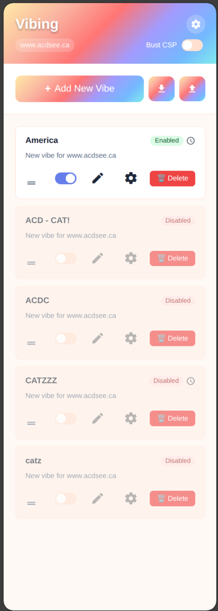

# Web Vibes

A chrome extension that let's you vibe hack any website on the fly, then save
your hacks for later use. Don't like the way a website looks? Change it! Want to
add some functionality? Add it! Want to remove some functionality? Remove it!
Wild, and crazy, and fun!

## Features 
- Vibe modify any website using the browser extension on the fly. When you feel 
  happy with your changes, you can save them for later use. All your saved 
  changes will be applied automatically when you visit the website again.
- Manage your list of saved vibes. Disable and enable them at will. Allowing full
  control over your vibe hacks.
- Works with any AI agent, just bring your API key

## Architecture

The codebase follows **SOLID principles** with clear separation of concerns:

- **Model Layer**: Business logic layer (`lib/`)
- **UI Layer**: User interface and interactions (`popup/`)

## Development Setup

1. Open Chrome and navigate to `chrome://extensions/`
2. Enable "Developer mode" in the top right
3. Click "Load unpacked" and select this project directory
4. The extension will be loaded and ready for development

